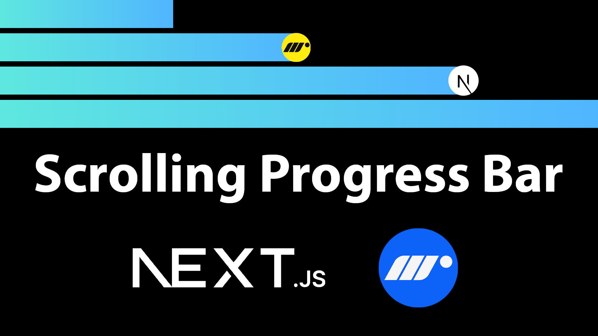

# Scroll Progress Bar in Next.js 15 using Motion | How to Create Scroll Progress Bar

Youtube Tutorial Link: https://youtu.be/bc5vaYEfhZk

Learn how to create a smooth and responsive scroll progress bar in Next.js 15 using Framer Motion. This project demonstrates how to visually track scroll progress across a page with a sleek animated bar at the top. It's a great way to enhance user experience and practice working with scroll events, layout effects, and animation in modern React applications.

